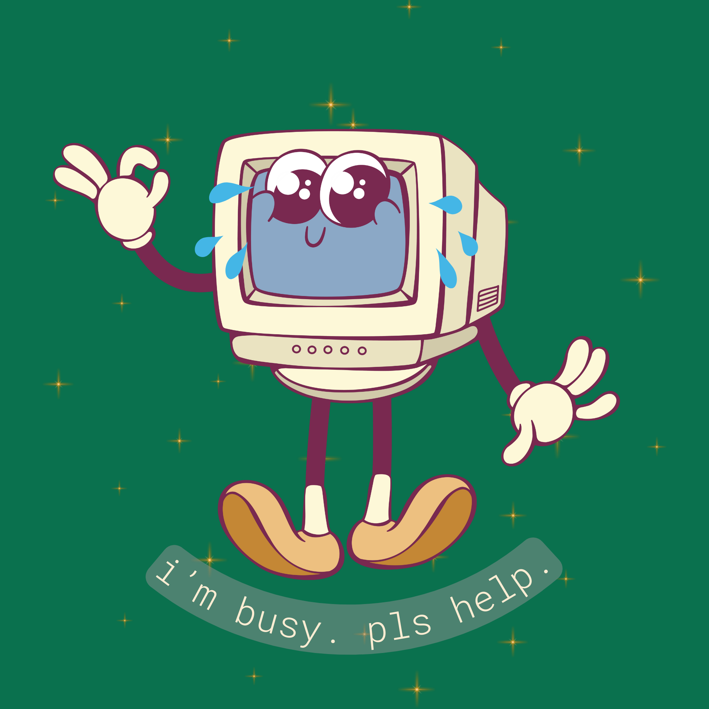

# Everyone is Busy! A Docs Strategy



When should you add visual elements to your docs? Let's get back to the
heart of what tech docs really are: solving problems when someone failed to
complete a task with just vibes.

There's a big divide between gen-pop docs and developers docs.
Everyone wants to hear hot takes about how to market to developers - how they're
_so lazy_ and _so smart_ and _please don't insult their intelligence_. I'm an
engineer and I'm here to tell you that I don't think engineers are super efficient
or super smart, they're just busy. Everyone is busy!

Good docs respect people's time. Take pointers from software development
principles - if your code is getting too complex, modularize it. Break it up
into smaller pieces until it is easier to digest. Visuals are one of the most
effective ways to do this; they can replace walls of text, isolate complex
concepts, or provide quick reference points.

---

## In This Post

- [The Problem](#the-problem)
- [The Strategy](#the-strategy)
- [The Framework in Practice](#the-framework-in-practice)
- [The Payoff](#the-payoff)
- [Summary](#summary)

---

## The Problem

Everyone is busy, context-switching constantly, and just trying
to solve their immediate problem, not deeply understand the system -
that might happen later, or over time through solving
immediate problems over and over. I'm not saying that it's
ideal, but it happens.

This echoes my experiences in food and fine arts archiving.
Chefs always wanted to wax poetically about their precious recipes
when everything is literally on fire - cool story bro, just give
me the goods: ingredients, measurements, steps.

While helping people navigate complex information systems in
special collections archives, I learned that people don't respond well
to prescribed paths, they want to choose their own adventure.

Forcing everyone into the same linear path of dense text
creates a traffic jam. People often only consult docs when they have
a problem. So solve their problem! Use visuals to keep it scannable,
actionable, and readable, because most people would rather enjoy
the thing than get stuck in the docs about the thing.

<div class="mermaid">
sequenceDiagram
    participant Engineer
    participant Docs

    Note over Engineer: Has urgent question:<br/>"What timestamp format?"

    Engineer->>Docs: Opens docs
    Docs-->>Engineer: 1. Here's context about timestamps...
    Note over Engineer: Okay, but where's the answer?

    Docs-->>Engineer: 2. Background on why timestamps matter...
    Note over Engineer: Still scrolling...

    Docs-->>Engineer: 3. Conceptual explanation of time...
    Note over Engineer: Gets frustrated

    Docs-->>Engineer: 4. Finally! Code sample with format
    Note over Engineer: Too late, already tried 3 formats

    Docs-->>Engineer: 5. Edge cases and caveats
    Note over Engineer: Ships something that works<br/>but might break later

    Note over Engineer,Docs: Result: Problem "solved"<br/>but tech debt created
</div>

---

## The Strategy

**Visual, Scannable, Actionable, Readable**

How do you design docs that respect people's time and
offer multiple entry points? Here's a framework
that's ordered by what matters most when people come
to the docs with a problem to solve:

1. **Visual = Assume Long Text Blocks Are Invisible**

    When docs get long, people's eyes glaze over. That
    text block might as well not be there.

    I learned this the hard way when I wrote a procedural guide
    for a database migration - 12 steps in careful prose.
    No one read it. People kept making the same mistakes and
    asking questions in Slack that were outlined in the doc.
    When I rewrote it as an annotated flowchart, suddenly
    people could follow it.

    Prose can be a blocker to people in problem-solving mode.
    As discussed in
    [Anti-pattern: Magic Numbers](antipattern-magic-numbers.md) -
    [Cognitive Load Theory](https://en.wikipedia.org/wiki/Cognitive_load)
    aka ["your brain's tab limit"](https://guy-oxnb.medium.com/cognitive-load-why-its-destroying-your-code-and-what-to-do-about-it-3c28cc0d3598):
    one can only consider a certain amount of details at a time.
    If you "have too many tabs open" - you'll have a harder time
    solving your problem and prose can be a tab multiplier.

    Not everyone's tabs are arranged in the same way either.
    People want to wander and not be lectured at. Visual docs create
    multiple access points and paths. A diagram can help someone
    jump to the piece they need. An annotated screenshot shows
    them exactly where to look. A table lets them compare options
    at a glance.

    | **Scenario** | **Visual Solution** | **Why It Works** |
    | -------------- | --------------------- | ------------------ |
    | 5+ sequential steps | Flowchart | Shows the path and decision points at a glance |
    | Comparing 3+ options | Table | Side-by-side comparison beats reading paragraphs |
    | Explaining UI interactions | Annotated Screenshot | "Click here" > "Navigate to the settings panel in the upper right" |
    | System Architecture | Diagram | Shows relationships and data flow visually |
    | Complex Conditional Logic | Decision Tree | Maps all the if/then branches people need to navigate |
    | Code Snippets | Inline Comments | Explains what's happening without breaking flow |

    **In Practice**:

    Think like a chef reviewing a recipe. You don't need to be sold the
    recipe, you're already using it. You don't need a story about how this dish
    represents the author's childhood in Provence. Visually scannable
    ingredients, measurements, and steps - that's what engineers want too.

2. **Scannable = Assume Nobody Reads Top-to-Bottom**

    Docs need to work for someone who's skimming, searching, or jumping
    halfway through. People need to be able to access information
    from wherever they land, and that's almost never from page one.

    | **Technique** | **Why It Matters** | **Example** |
    | --------------- | ------------------- | ------------- |
    | **Descriptive Headings That Answer Questions** | People scan headers to find their section | Not "Overview" but "When to use the bulk processing API vs. individual transactions" |
    | **Frontload the Answer** | Put solution first, explanation second | "Use ISO 8601 format (YYYY-MM-DDTHH:mm:ssZ). This ensures consistent timezone handling across services." |
    | **Visual Hierarchy** | Create scannable "checkpoints" | Use formatting breaks so someone can land on the section they need |

    ```markdown
    <!-- Top-heavy Prose -->
    ## Timestamp Handling

    Our API uses timestamps in several places. It's important to understand 
    how timestamps work because they affect caching, rate limiting, and data 
    consistency. When you send a request...

    ---

    <!-- Actionable -->
    ## Use ISO 8601 format for all timestamps

    **Format:** `YYYY-MM-DDTHH:mm:ssZ`  
    **Example:** `2026-02-05T14:30:00Z`

    Why this matters: Ensures timezone consistency across services and prevents 
    caching issues.

    [See: Timestamp handling in rate limiting →]
    ```

    **In Practice**:

    Special collections researchers usually don't start at Box 1, Folder 1. They
    scan the finding aid, land somewhere interesting, and explore from there.
    Your docs should work the same way.

3. **Actionable = Assume Everyone Has a Specific Problem**

    People who wake up thinking, "I'd love to learn about your payment processing
    architecture today" is probably a very short list. Most people come to your
    docs because they have a very specific problem: their integration isn't working,
    they need to implement a feature, something broke and they need to fix it.
    Help them fix it.

    | **Technique** | **Why It Matters** | **Example** |
    | --------------- | ------------------- | ------------- |
    | **Start with the task, not the explanation** | People have a specific problem to solve | "To process a refund:" not "Understanding refund processing:" |
    | **Code Samples Over Prose** | Show don't tell when possible | Working code example beats paragraph explanation |
    | **Copy-paste-friendly Examples** | Let people get started immediately | Real values, not `<YOUR_VALUE_HERE>` |
    | **Expected Outcomes** | Tell people what success looks like | Show the response they should see when it works |

    ```markdown
    <!-- Top-heavy Prose -->
    ## Refund Processing

    Refunds are handled through the refund endpoint. You'll need to provide 
    the original transaction ID and the amount to refund. Note that partial 
    refunds are supported.
    ```

    ```bash
    # Copy-paste-friendly Examples
    # Process a refund
    curl -X POST https://api.example.com/v1/refunds \
    -H "Authorization: Bearer sk_live_abc123" \
    -d transaction_id="txn_xyz789" \
    -d amount=2500 \
    -d reason="customer_request"

    # Success Response - JSON
    {
    "id": "ref_def456",
    "status": "completed",
    "amount": 2500,
    "transaction_id": "txn_xyz789"
    }

    # Options for more info
    **Next steps:** 
    - Check refund status: `GET /v1/refunds/{refund_id}`
    - For partial refunds, set `amount` to less than the original transaction
    - See: Refund webhooks
    ```

    **In Practice**:

    Back to the kitchen. When you're in the weeds during service and need to
    know "how long does this go in the oven?" you don't want a lecture on heat
    transfer. You want "425°F, 12 minutes." That's actionable.

4. **Readable = Everyone's Busy and Tired**

    Cognitive load is real. Someone reading your docs at 2 AM during an incident
    is not operating at full capacity. Someone reading on their phone while
    commuting is not either.

    | **Technique** | **Why It Matters** | **Example** |
    | --------------- | ------------------- | ------------- |
    | **Short sentences. Short paragraphs. Lots of whitespace.** | Reduce cognitive load | Break up dense text so people can breathe |
    | **One concept per chunk** | Avoid overwhelming readers | If you're explaining three things, use three distinct sections with clear headers |
    | **Progressive Disclosure** | Respect different depth needs | Give the essential info first, link to deeper explanations for people who want them |
    | **Conversational Tone** | Make it approachable | You're helping a colleague, not writing a textbook |

    **In Practice**:

    Rarely do readers come to your docs prepared to absorb a novel. They're sleepy,
    they're context-switching, they're multi-tasking. Make it easy.

---

## The Framework in Practice

| **Step** | **Action** | **Goal** |
| ---------- | ----------- | ---------- |
| **Ask** | Identify the core question | What is the reader trying to do or figure out? |
| **Answer** | Answer it immediately | Put the solution in the first 2-3 lines |
| **Explain** | Provide the minimal viable explanation | Just enough context to use it correctly |
| **Structure** | Make it scannable | Headers, formatting, visual breaks |
| **Visualize** | Add visuals if it's getting long | Diagram, screenshot, table, code sample |
| **Expand** | Link to deeper content | For people who want/need more |

**Usability Test:** Can a new reader skim it and solve their problem in
under 2 minutes? If not, iterate.

---

## The Payoff

Good docs aren't always about being comprehensive. It's about being
useful to someone's who's busy, distracted, and trying to solve a
specific problem.

| **Outcome** | **Impact** |
| ------------- | ----------- |
| **Reduced Time-to-Resolution for Common Issues** | Engineers find answers in runbooks faster |
| **Fewer "How do I...?" questions in Slack** | People self-serve |
| **Higher Docs Usage Metrics** | People actually reading what you wrote |
| **Better Onboarding Experience** | New engineers ramp up independently |

---

## Summary

1. **Everyone is Busy!**

    Respect people's time with clarity. Structure your docs like modular
    code - break it up into smaller pieces until it's easier to digest.

2. **People Often Only Consult Docs When They Have a Problem**

    So solve their problem! Frontload the solution, give them the option
    to explore more context if they so choose.

3. **Create Multiple Entry Points**

    Readers should be able to jump in anywhere and find what they need.
    Visuals and scannable structure let people navigate on their terms.

4. **Visual > Text When Things Get Long**

    When do you add visual elements? When docs gets long. Diagrams,
    screenshots, tables, flowcharts - these aren't decoration, they're
    navigation tools and comprehension aids.

5. **Everyone Would Rather Enjoy the Thing Than Get Stuck in the Docs About the Thing**

    Keep it scannable, actionable, and readable. Like a good recipe:
    ingredients, measurements, steps. No stories about Provence.
